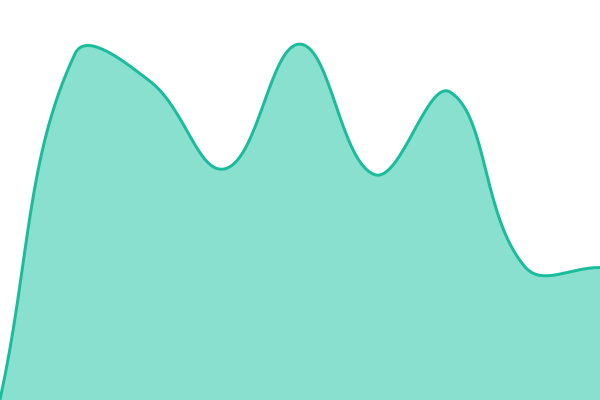

# [📈 Live Status](https://jrmochoa.github.io/sbc-aralinks-status): <!--live status--> **🟩 All systems operational**

This repository contains the open-source uptime monitor and status page for [jrmochoa](https://jrmochoa.github.io/sbc-aralinks-status), powered by [Upptime](https://github.com/upptime/upptime).

With [Upptime](https://upptime.js.org), you can get your own unlimited and free uptime monitor and status page, powered entirely by a GitHub repository. We use [Issues](https://github.com/jrmochoa/sbc-aralinks-status/issues) as incident reports, [Actions](https://github.com/jrmochoa/sbc-aralinks-status/actions) as uptime monitors, and [Pages](https://jrmochoa.github.io/sbc-aralinks-status) for the status page.

<!--start: status pages-->
<!-- This summary is generated by Upptime (https://github.com/upptime/upptime) -->
<!-- Do not edit this manually, your changes will be overwritten -->
<!-- prettier-ignore -->
| URL | Status | History | Response Time | Uptime |
| --- | ------ | ------- | ------------- | ------ |
|  [SBC JHS 1](https://sbcjhs1.aralinks.net) | 🟩 Up | [sbc-jhs-1.yml](https://github.com/jrmochoa/sbc-aralinks-status/commits/HEAD/history/sbc-jhs-1.yml) | 

 1908ms
     
 | 

<a href="https://jrmochoa.github.io/sbc-aralinks-status/history/sbc-jhs-1">100.00%</a>
    

|  [SBC JHS 2](https://sbcjhs2.aralinks.net) | 🟩 Up | [sbc-jhs-2.yml](https://github.com/jrmochoa/sbc-aralinks-status/commits/HEAD/history/sbc-jhs-2.yml) | 

 1667ms
     
 | 

<a href="https://jrmochoa.github.io/sbc-aralinks-status/history/sbc-jhs-2">100.00%</a>
    

|  [SBC GS 1](https://sbcgs1.aralinks.net) | 🟩 Up | [sbc-gs-1.yml](https://github.com/jrmochoa/sbc-aralinks-status/commits/HEAD/history/sbc-gs-1.yml) | 

 1779ms
     
 | 

<a href="https://jrmochoa.github.io/sbc-aralinks-status/history/sbc-gs-1">100.00%</a>
    

|  [SBC GS 2](https://sbcgs2.aralinks.net) | 🟩 Up | [sbc-gs-2.yml](https://github.com/jrmochoa/sbc-aralinks-status/commits/HEAD/history/sbc-gs-2.yml) | 

 1936ms
     
 | 

<a href="https://jrmochoa.github.io/sbc-aralinks-status/history/sbc-gs-2">100.00%</a>
    

|  [SBC SHS](https://sbcshs.aralinks.net) | 🟩 Up | [sbc-shs.yml](https://github.com/jrmochoa/sbc-aralinks-status/commits/HEAD/history/sbc-shs.yml) | 

 1796ms
     
 | 

<a href="https://jrmochoa.github.io/sbc-aralinks-status/history/sbc-shs">100.00%</a>
    

<!--end: status pages-->

[**Visit our status website →**](https://jrmochoa.github.io/sbc-aralinks-status)

## 📄 License

- Powered by: [Upptime](https://github.com/upptime/upptime)
- Code: [MIT](./LICENSE) © [Anand Chowdhary](https://anandchowdhary.com)
- Data in the `./history` directory: [Open Database License](https://opendatacommons.org/licenses/odbl/1-0/)
